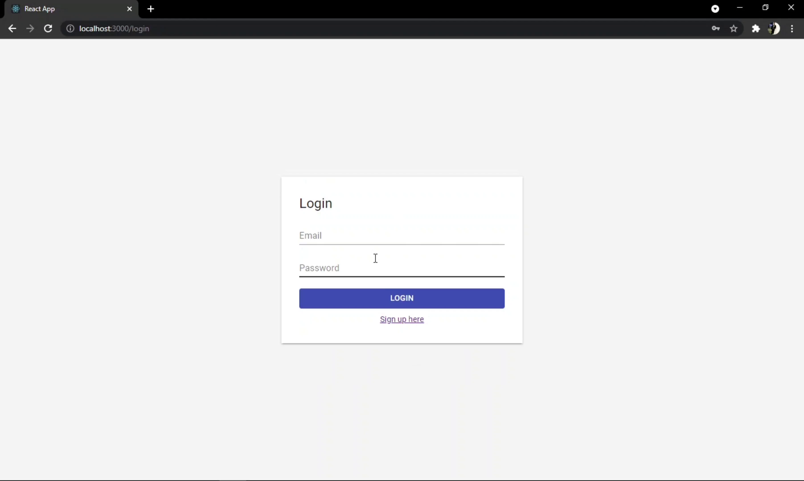
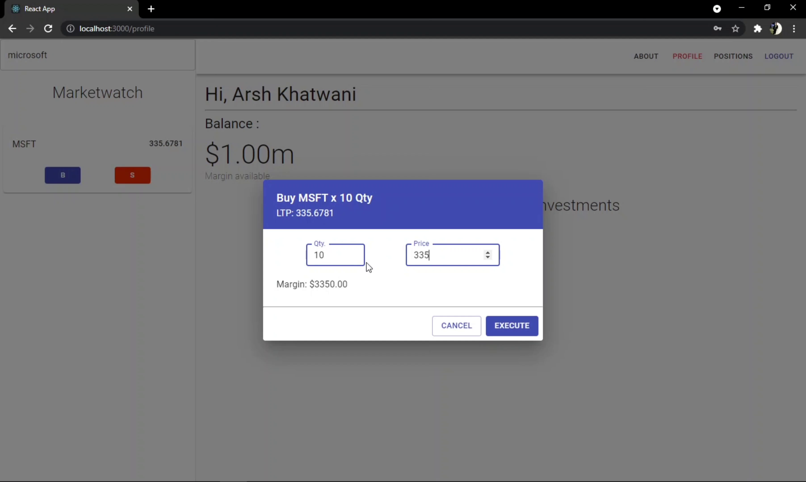
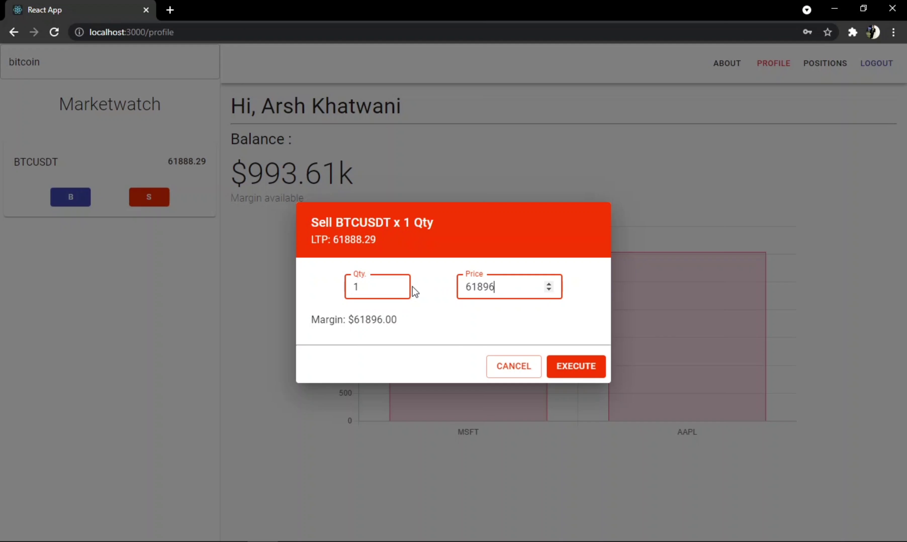
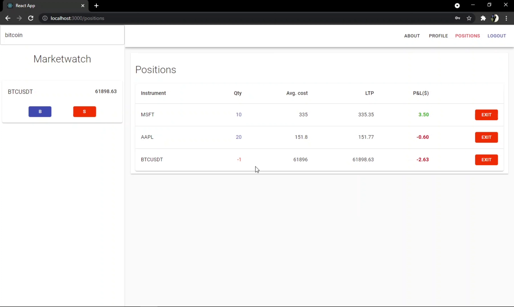
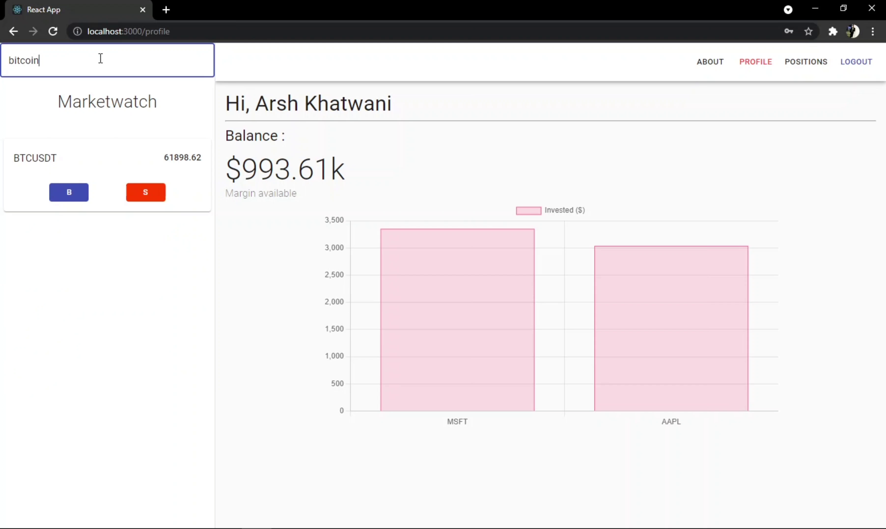

# Virtual Trading Terminal

- The project facilitates trading of stocks and cryptocurrency in the US through virtual currency.
- Users first need to register and create their account. The account is credited with a virtual currency amounting $ 1 million.
- Post registration the users can purchase/ sell stocks and cryptos given in the watchlist, and can also search for specific instrument.
- The ‘Positions’ page enables to track the current position of a purchase/sell of different instruments.
- The Front-end is developed using React and back-end is developed using NodeJS with MongoDB as a database.
- Socket IO and Finnhub API is used for streaming live market prices and JWT serves the purpose for authentication.

### Project video [here](./project_video_and_screenshots/project_video.mp4)

## Screenshots

